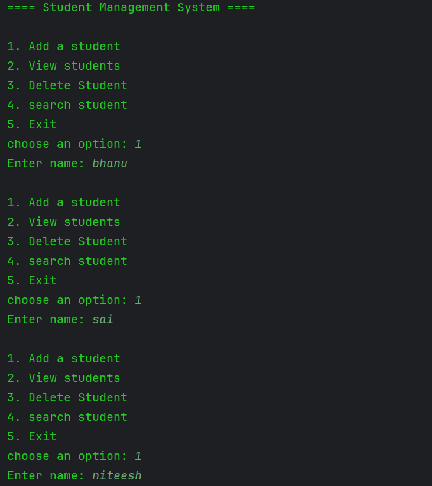
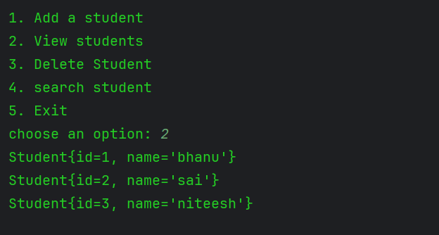
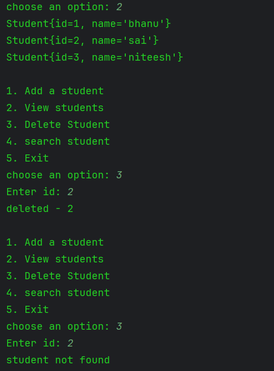
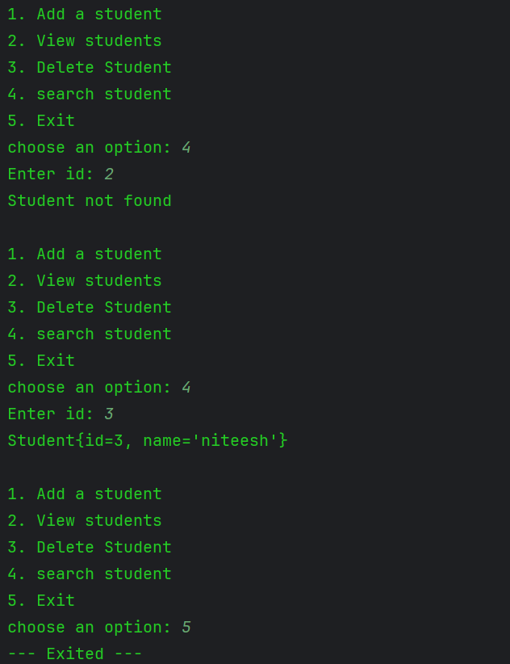

# 🚀 Student Management System (Spring Core)

## 📌 Overview
This is a console-based Student Management System built using Spring Core.  
It demonstrates core concepts like Dependency Injection, Bean Configuration, and layered architecture.

---

## ✨ Features
- Add Student
- View Students
- Delete Student
- Search Student
- Exit system

---

## 🧠 Concepts Used
- Inversion of Control (IoC)
- Dependency Injection (DI)
- Bean Configuration (@Configuration, @Bean)
- Layered Architecture

---

## 🛠️ Tech Stack
- Java
- Spring Core
- Maven

---

## ▶️ How to Run
1. Clone the repository  
2. Open the project in IntelliJ IDEA  
3. Run `StudentappApplication`  

---

## 📷 Sample Output

### ➕ Add Student

### 📄 View Students

### ❌ Delete Student

### 🔍 Search Student

---

## 📌 Author
Bhanu
